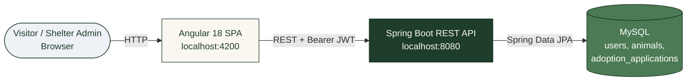
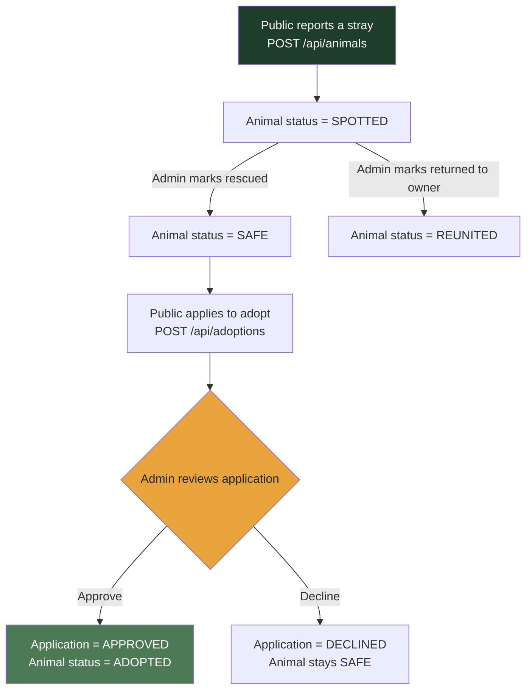
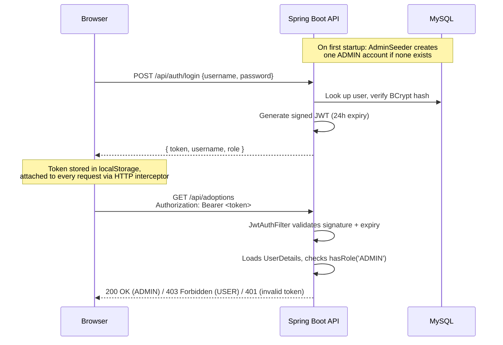

<div align="center">

# 🐾 PawRescue

### Stray Animal Reporting & Adoption Platform

Report a stray, track it from sighting to safety, and rehome it — all in one place. Powered by Spring Boot, backed by MySQL, secured with JWT auth, served by Angular.

[](https://openjdk.org/)
[](https://spring.io/projects/spring-boot)
[](https://spring.io/projects/spring-security)
[](https://www.mysql.com/)
[](https://angular.dev/)
[](https://jwt.io/)
[](#license)

[Overview](#overview) • [Features](#features) • [Architecture](#architecture) • [Getting Started](#getting-started) • [API Reference](#api-reference)

</div>

---

## Overview

**PawRescue** coordinates the full lifecycle of a stray animal report: someone spots an animal and logs it, the community and shelter staff track it through to safety, and — once it's housed at a shelter — it becomes available for adoption. A shelter admin reviews adoption applications and approves the best fit; approval automatically flips the animal's status to **Adopted**.

Built as a two-tier web stack: a **Spring Boot REST API** on top of **MySQL** via Spring Data JPA, secured with **stateless JWT auth**, served by a separate **Angular 18** single-page frontend (standalone components, signals, reactive forms).

Two things this app is deliberately strict about:
- **Anyone can report a stray or apply to adopt — no account needed.** Lowering friction for the public matters more than gatekeeping input.
- **Only the seeded shelter admin account can review applications or change an animal's status.** This is enforced in Spring Security's route rules, not just hidden in the UI — a regular applicant account cannot approve its own application by, say, editing the DOM or calling the API directly.

---

## Features

| Category | Feature | Description |
|---|---|---|
| **Core** | Sightings Board | Every reported animal in one searchable, filterable grid — by species, status, or free-text (breed/color/location) |
| **Core** | Report a Stray | Public form: species, breed/mix, colors, size, location, description, optional photo URL, optional finder contact info |
| **Core** | Status lifecycle | `SPOTTED → SAFE → ADOPTED`, with a `REUNITED` branch for animals returned to their original owner |
| **Core** | Adoption applications | Public form per animal: applicant name, email, phone, housing type, pet experience, message |
| **Core** | Adoption review dashboard | Admin-only queue of Pending / Approved / Declined applications; approving one auto-transitions the animal to `ADOPTED` |
| **Core** | Live dashboard stats | Total Reports, Active Spotted, Rescued & Safe, Happy Endings (Reunited + Adopted) — computed server-side, not cached client counts |
| **Auth** | JWT login | Stateless Bearer-token auth, BCrypt-hashed passwords, 24-hour token expiry |
| **Auth** | Role-gated admin actions | `USER` vs `ADMIN` role enforced server-side on every review/status-change endpoint |
| **Auth** | Seeded admin account | One `ADMIN` account auto-created on first backend startup — no manual DB surgery needed to get started |
| **Data integrity** | Ownership-free but rule-bound writes | Public write endpoints (report, apply) are open, but every state transition (approve/decline/status change) is admin-only and validated server-side |
| **Resilience** | Clean error responses | A global exception handler turns validation errors, not-found cases, and bad credentials into consistent JSON — no raw stack traces reach the client |
| **UX** | CORS-safe SPA split | Angular dev server and Spring Boot API run on separate ports with an explicit CORS + preflight (`OPTIONS`) policy, rather than serving the frontend as static resources |

---

## Tech Stack

| Layer | Technology |
|---|---|
| Backend | Java 17, Spring Boot 3.3 (Web, Data JPA, Validation, Security) |
| Database | MySQL 8.x via Spring Data JPA (`ddl-auto: update`) |
| Auth | Spring Security + JWT (`jjwt`), BCrypt password hashing |
| Frontend | Angular 18 — standalone components, signals, reactive forms, functional guards/interceptors |
| HTTP client | Angular `HttpClient` with a functional interceptor attaching the JWT to every request |
| Build | Maven (backend), Angular CLI / npm (frontend) |

---

## Architecture

### System overview



### Sighting-to-adoption lifecycle



### Authentication flow



### Project structure

```
pawrescue/
├── README.md
├── backend/
│   ├── pom.xml
│   └── src/main/
│       ├── java/com/pawrescue/
│       │   ├── PawrescueApplication.java
│       │   ├── config/
│       │   │   ├── SecurityConfig.java          # CORS, stateless sessions, route rules
│       │   │   ├── JwtUtil.java                 # sign/parse/validate JWTs
│       │   │   ├── JwtAuthFilter.java            # Bearer-token auth filter
│       │   │   ├── CustomUserDetailsService.java
│       │   │   └── AdminSeeder.java              # seeds the one ADMIN account on startup
│       │   ├── model/                            # User, Animal, AdoptionApplication + enums
│       │   ├── repository/                       # Spring Data JPA repositories
│       │   ├── service/                          # AuthService, AnimalService, AdoptionService
│       │   ├── controller/                       # AuthController, AnimalController, AdoptionController, StatsController
│       │   ├── dto/                               # Request/response payloads + validation
│       │   └── exception/                        # Custom exceptions + GlobalExceptionHandler
│       └── resources/
│           └── application.yml                    # datasource, JWT secret, CORS origin, admin seed creds
└── frontend/
    ├── package.json / angular.json
    └── src/app/
        ├── core/
        │   ├── models/                            # animal, adoption, auth TS interfaces
        │   ├── services/                          # AnimalService, AdoptionService, AuthService
        │   ├── guards/auth.guard.ts                # blocks non-admins from /adoptions
        │   └── interceptors/auth.interceptor.ts    # attaches JWT to outgoing requests
        ├── shared/components/
        │   ├── navbar/
        │   └── stats-cards/
        └── features/
            ├── sightings-board/                    # grid + search/filter + status changer (admin)
            │   └── adopt-modal/                     # "Apply to Adopt" form
            ├── report-stray/                       # public sighting report form
            ├── adoption-center/                     # admin review dashboard
            └── auth/                                # login / register
```

---

## Getting Started

### Prerequisites

| Requirement | Version |
|---|---|
| Java (JDK) | 17+ |
| Maven | 3.8+ |
| MySQL | 8.x |
| Node.js | 18+ |
| npm | 9+ |

### 1. Backend

```bash
cd backend
```

Edit `src/main/resources/application.yml` if your MySQL credentials aren't
the defaults (`root` / `root`):
```yaml
spring:
  datasource:
    url: jdbc:mysql://localhost:3306/pawrescue?createDatabaseIfNotExist=true&useSSL=false&serverTimezone=UTC
    username: root
    password: root
```
`createDatabaseIfNotExist=true` means you don't need to manually create the
schema — Hibernate creates and updates every table on startup
(`ddl-auto: update`).

```bash
mvn spring-boot:run
```
The API starts on **http://localhost:8080**. On first run, watch the logs
for:
```
Seeded admin account 'admin' — log in with this account to review adoption applications.
```

### 2. Frontend

```bash
cd frontend
npm install
npm start
```
Opens on **http://localhost:4200**, talking to the API at
`http://localhost:8080/api` (see `src/environments/environment.ts`).

### 3. Try it out

1. Open `http://localhost:4200` — the Sightings Board loads empty.
2. Go to **+ Report Stray** and submit an animal (no login needed).
3. Log in at **/login** with the seeded admin account:
   ```
   username: admin
   password: ChangeMe123!
   ```
4. Back on the Sightings Board, use the **Update status** dropdown on that
   animal's card to set it to `SAFE`.
5. Log out (or open an incognito window) and click **Apply to Adopt** on
   that animal — submit the application, no login required.
6. Log back in as `admin`, open **Adoption Center**, and **Approve** the
   application. The animal's status flips to `ADOPTED` automatically.

**Change the seeded admin password** in `application.yml` before this goes
anywhere beyond your own machine:
```yaml
app:
  admin:
    username: admin
    email: admin@pawrescue.com
    password: ChangeMe123!
```

---

## API Reference

### Auth — `/api/auth`

| Method | Endpoint | Auth required | Description |
|---|---|---|---|
| POST | `/register` | No | Create a `USER` account, returns a JWT |
| POST | `/login` | No | Log in, returns a JWT + role |

### Animals — `/api/animals`

| Method | Endpoint | Auth required | Description |
|---|---|---|---|
| GET | `/api/animals?species=&status=&search=` | No | Search/filter sightings |
| GET | `/api/animals/{id}` | No | Single animal detail |
| POST | `/api/animals` | No | Report a stray |
| PUT | `/api/animals/{id}/status` | ADMIN | Change status (Spotted/Safe/Reunited/Adopted) |
| DELETE | `/api/animals/{id}` | ADMIN | Remove a listing |

### Stats — `/api/stats`

| Method | Endpoint | Auth required | Description |
|---|---|---|---|
| GET | `/api/stats` | No | Dashboard totals: reports, active spotted, rescued & safe, happy endings |

### Adoptions — `/api/adoptions`

| Method | Endpoint | Auth required | Description |
|---|---|---|---|
| POST | `/api/adoptions` | No | Submit an adoption application for an animal |
| GET | `/api/adoptions?status=` | ADMIN | List applications, optionally filtered by status |
| PUT | `/api/adoptions/{id}/approve` | ADMIN | Approve → animal auto-marked `ADOPTED` |
| PUT | `/api/adoptions/{id}/decline` | ADMIN | Decline application |

**Example — apply to adopt:**
```json
POST /api/adoptions

{
  "animalId": 3,
  "applicantName": "The Henderson Family",
  "email": "henderson.homes@example.com",
  "phone": "555-0123",
  "housingType": "HOUSE_FENCED_YARD",
  "petExperience": "INTERMEDIATE",
  "message": "We have a large fenced yard and two kids who love dogs."
}
```

**Example — approve an application:**
```
PUT /api/adoptions/7/approve
Authorization: Bearer <admin JWT>
```

---

## Database Schema

| Table | Key Columns | Purpose |
|---|---|---|
| `users` | `id`, `username` (unique), `email` (unique), `password` (BCrypt hash), `role` | `USER` (applicants/reporters) or `ADMIN` (shelter staff) |
| `animals` | `id`, `species`, `breed`, `colors`, `size`, `description`, `location_details`, `image_url`, `status`, `contact_phone`, `contact_email`, `created_at`, `updated_at` | One row per reported sighting |
| `adoption_applications` | `id`, `animal_id` (FK), `applicant_name`, `email`, `phone`, `housing_type`, `pet_experience`, `message`, `status`, `applied_at`, `decided_at` | One row per adoption request |

All tables are created and kept in sync automatically via
`spring.jpa.hibernate.ddl-auto: update` — no manual migration step required
for local development.

---

## Design Notes

- **Admin-only actions are enforced in `SecurityConfig`, not the UI.** `GET /api/adoptions`, `approve`, `decline`, and animal status updates all require `hasRole('ADMIN')` at the route-matcher level — hiding a button in Angular is not the security boundary.
- **CORS preflight is explicitly permitted.** Any authenticated request from the Angular app triggers a browser `OPTIONS` preflight; `SecurityConfig` explicitly `permitAll()`s `OPTIONS` requests before any other rule, otherwise the preflight itself gets rejected as unauthenticated and the browser blocks the real request.
- **Approval is the single source of truth for "Adopted."** `AdoptionService.approve()` updates both the application and the animal's status inside the same `@Transactional` method, so the two can never drift out of sync.
- **Reporting and applying stay public on purpose.** Requiring an account to report a stray or apply to adopt would suppress exactly the input this app exists to collect; the trust boundary sits at *review*, not *submission*.

## Contributing

Contributions, issues, and feature requests are welcome. Feel free to open an issue or submit a pull request.
